# Cake AI

A demo project for system architecture desing and development

The purpose of project is just to show some approach for system design, development and give some examples.

Cake AI is an abstract system for baking cakes by artificial intelligence. It's provided to users by a sales web application in which customers can order some cake for their own idea based on a prompt.

# Mind map
Let's consider the overall considerations and ideas first.

# Use cases

Now, let's make some user scenarios possible in the application.

```mermaid
%%{
  init: {
    "flowchart": {
      "htmlLabels": false
    }
  }
}%%
flowchart LR
    customer(("Customer 🧑"))
    employee(("Employee 👷‍♂️"))

    receive_notifications("Receive notifications")

    creating_orders("Creating orders")
    editing_orders("Editing orders")
    pay_order("Pay for order")
    canceling_order("Canceling order")
    
    create_account("Creating account")
    managing_account("Managing account")
    login("Login")
    deleting_account("Deleting account")
    editing_account("Editing account")
    
    managing_orders("Managing orders")
    managing_orders-->creating_orders
    managing_orders-->pay_order
    managing_orders-->editing_orders
    
    editing_orders-->canceling_order
    
    customer-->receive_notifications
    customer-->managing_orders
    customer-->create_account
    customer-->managing_account

    managing_account-->login
    managing_account-->editing_account
    managing_account-->|if customer|deleting_account
    managing_account-->create_account
        
    employee-->managing_orders
    employee-->managing_account


```

# Business considerations

According to UK market in 2012 there were 139 million kilograms of cake sold. Assuming that a medium-size typical weight is around 2kg it gives us almost 70 millions of cakes per year = about 6 million per month = about 200 thousands per day.

For our example let's consider that our company want to share 20% of market from which 10% are internet sales. It gives us about 20k orders per day, so about 14 per minute.

We are assuming that the number of 20k orders is a result of 200k visitors, so 10% of site visitors will be our customers.

Also we know that baking process will start only for fixed amount of orders, when ovens are full, so we can use maximum eco-approach for power compsumption. That means that we should be ready for some internal data peaks - when ovens finish baking process there are many messages published about process finished simultaneously. 

# Architecture

We can extract some key architecture parameters according to business requirements:
1. Maintainability and Extensibility
   - as baking process is not constant - it can change in any time due to new food components, due to machinery replacement or just recipes for pre-ingredients are changed - the system should be adjustable to these conditions
2. Security
   - because we act with food and meals the system should be secured enough to prevent some unauthorized access and operations
3. Performance
   - when talking about real world machinery and production process of cakes we should take care of our system be fast enough to not block physical devices
4. Scalability
   - knowing the fact that there are some periods in which customer order more than usual (e.g. national celebrations, summer etc.), the system should handle scalability properly to handle all customers requests

## System context

Let's see what is in the system context - an abstract view on all parts.

## Containers

In a little deeper layer we can see one of systems - Ordering System - a system which customer can make an order in.

Now let's focues on Baking System. Here operations connected with real world processes are performed like baking, storing things, instrumenting robots.

