# Cake AI

A demo project for system architecture desing and development

The purpose of project is just to show some approach for system design, development and give some examples.

Cake AI is an abstract system for baking cakes by artificial intelligence. It's provided to users by a sales web application in which customers can order some cake for their own idea based on a prompt.

# Mind map
Let's consider the overall considerations and ideas first.

# Use cases

Now, let's make some user scenarios possible in the application.

```mermaid
%%{
  init: {
    "flowchart": {
      "htmlLabels": false
    }
  }
}%%
flowchart LR
    customer(("Customer 🧑"))
    employee(("Employee 👷‍♂️"))

    receive_notifications("Receive notifications")

    creating_orders("Creating orders")
    editing_orders("Editing orders")
    pay_order("Pay for order")
    canceling_order("Canceling order")
    
    create_account("Creating account")
    managing_account("Managing account")
    login("Login")
    deleting_account("Deleting account")
    editing_account("Editing account")
    
    managing_orders("Managing orders")
    managing_orders-->creating_orders
    managing_orders-->pay_order
    managing_orders-->editing_orders
    
    editing_orders-->canceling_order
    
    customer-->receive_notifications
    customer-->managing_orders
    customer-->create_account
    customer-->managing_account

    managing_account-->login
    managing_account-->editing_account
    managing_account-->|if customer|deleting_account
    managing_account-->create_account
        
    employee-->managing_orders
    employee-->managing_account


```

# System context

Let's see what is in the system context - an abstract view on all parts.

# Containers

In a little deeper layer we can see one of systems - Ordering System in more detailed view.

